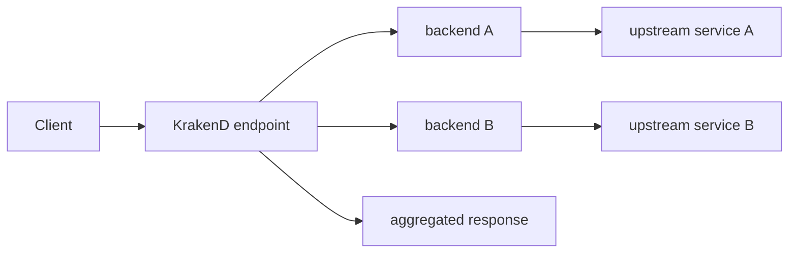
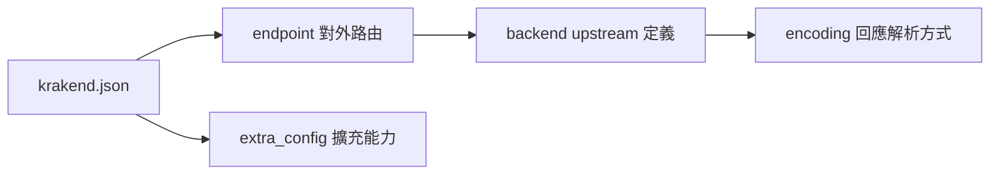

# Lab 00：KrakenD 核心名詞導讀

目標：先看懂 KrakenD 設定檔中的核心名詞，讓後續 Lab 的每個設定都有對應位置。

預估時間：20 分鐘。

這份文件不用急著背。你只要先知道每個名詞在 `krakend.json` 裡的位置，以及它負責哪一段請求流程。

## 一張圖先看整體



KrakenD 的核心工作是把外部 client 打進來的 endpoint，轉成一個或多個 backend 請求，再把結果整理後回傳。

## `krakend.json`

`krakend.json` 是 KrakenD 的主要設定檔。常見最小結構如下：

```json
{
  "$schema": "https://www.krakend.io/schema/v2.13/krakend.json",
  "version": 3,
  "endpoints": [],
  "extra_config": {}
}
```

你在哪裡看到：

- 專案根目錄或容器內的 `/etc/krakend/krakend.json`
- `docker run ... krakend check --config krakend.json`

常見問題：

- `version` 是設定檔格式版本，不是 KrakenD 執行檔版本。
- `$schema` 建議保留，因為 IDE 可以用它做自動補完與提示。

## `endpoint`

`endpoint` 是 KrakenD 對外提供給 client 呼叫的路由。

範例：

```json
{
  "endpoint": "/users/{id}",
  "method": "GET",
  "backend": []
}
```

你在哪裡看到：

- `endpoints` 陣列中的每一個物件
- client 實際呼叫的 URL 路徑

常見問題：

- `endpoint` 是對外 API，不一定要和 backend 的路徑相同。
- 路徑參數例如 `{id}` 可以傳給 backend 的 `url_pattern` 使用。

## `backend`

`backend` 是 KrakenD 要去呼叫的 upstream 來源。它可以是一個 HTTP API，也可以是其他 KrakenD 支援的來源。

範例：

```json
{
  "host": ["https://jsonplaceholder.typicode.com"],
  "url_pattern": "/users/{id}"
}
```

你在哪裡看到：

- 每個 endpoint 底下的 `backend` 陣列
- `host` 與 `url_pattern` 組合成 KrakenD 實際呼叫的 upstream URL

常見問題：

- 一個 endpoint 可以有多個 backend。
- 預設情況下，多個 backend 會平行呼叫並聚合結果；需要依序呼叫時才使用 sequential proxy。

## `extra_config`

`extra_config` 是 KrakenD 各種能力的擴充設定入口。它可以放在 root、endpoint、backend 等不同範圍。

範例：

```json
{
  "extra_config": {
    "router": {
      "hide_version_header": true
    }
  }
}
```

你在哪裡看到：

- root 層：影響整個 gateway。
- endpoint 層：影響單一對外路由。
- backend 層：影響單一 upstream 呼叫。

常見問題：

- 放錯層級時，設定可能不會生效。
- 看到 namespace 例如 `qos/ratelimit/router` 時，先確認官方文件標示的支援範圍。

## `encoding`

`encoding` 決定 KrakenD 如何解析或處理 backend 回應。

常見值：

| `encoding` | 用途 |
| --- | --- |
| `json` | 解析 JSON 並允許聚合與欄位整理 |
| `no-op` | 盡量原樣代理，不做聚合整理 |
| `string` | 將回應視為字串 |

常見問題：

- 想要練習聚合與欄位整理時，優先使用 `json`。
- 想做接近 reverse proxy 的轉送時，才考慮 `no-op`。

## 一分鐘總結



記住這個順序：`endpoint` 是 client 看見的 API，`backend` 是 KrakenD 背後呼叫的服務，`extra_config` 是把安全、限流、觀測、路由等能力掛到正確範圍。

## 本章學習重點回顧

完成這章後，你應該能把 `krakend.json` 的每一段設定對應到請求流程：

1. Client 呼叫 `endpoint`。
2. KrakenD 依照 endpoint 底下的 `backend` 找 upstream。
3. KrakenD 依照 `encoding` 解析 backend 回應。
4. KrakenD 依照不同層級的 `extra_config` 套用額外行為。
