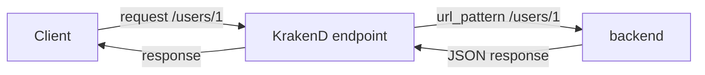

# Lab 01：建立第一個 KrakenD Gateway

目標：建立一個最小可執行的 KrakenD Gateway，讓 `/users/{id}` 轉送到公開測試 API。

預估時間：30 分鐘。

## 你會做出什麼

```mermaid
flowchart LR
    Client[Client] --> Gateway[KrakenD GET /users/{id}]
    Gateway --> Backend[JSONPlaceholder GET /users/{id}]
    Backend --> Gateway
    Gateway --> Client
```

`Client` 只知道 KrakenD 的 `/users/{id}`。KrakenD 會把 `{id}` 帶到 backend 的 `/users/{id}`，再把結果回傳。

## Step 1：建立 Lab 工作目錄

1. 在 `docs/KrakenD-training` 外建立一個臨時操作資料夾，例如：

```powershell
mkdir krakend-lab-01
cd krakend-lab-01
```

2. 確認目前資料夾沒有舊的 `krakend.json`：

```powershell
Get-ChildItem
```

說明：每個 Lab 使用乾淨資料夾，能避免上一個 Lab 的 endpoint 或限流設定影響這次結果。

## Step 2：建立 `krakend.json`

1. 在目前資料夾新增 `krakend.json`。
2. 貼上以下內容：

```json
{
  "$schema": "https://www.krakend.io/schema/v2.13/krakend.json",
  "version": 3,
  "name": "krakend-lab-01",
  "port": 8080,
  "endpoints": [
    {
      "endpoint": "/users/{id}",
      "method": "GET",
      "backend": [
        {
          "host": ["https://jsonplaceholder.typicode.com"],
          "url_pattern": "/users/{id}",
          "encoding": "json"
        }
      ]
    }
  ]
}
```

重要設定：

| Parameter | Value |
| --- | --- |
| `version` | `3` |
| `port` | `8080` |
| `endpoint` | `/users/{id}` |
| `method` | `GET` |
| `host` | `https://jsonplaceholder.typicode.com` |
| `url_pattern` | `/users/{id}` |
| `encoding` | `json` |

說明：`endpoint` 是對外路徑，`url_pattern` 是 KrakenD 對 backend 發出的路徑。這兩個可以相同，也可以不同。

## Step 3：驗證設定檔

1. 在 `krakend.json` 所在資料夾執行：

```powershell
docker run --rm -it -v "${PWD}:/etc/krakend/" krakend check --config krakend.json
```

2. 確認輸出沒有 JSON 格式錯誤或路由衝突。

說明：`krakend check` 會檢查設定檔是否能被 KrakenD 解析。先 check 再 run，可以把錯誤停在啟動前。

## Step 4：啟動 Gateway

1. 保留目前的 `krakend.json`。
2. 執行：

```powershell
docker run --rm -p 8080:8080 -v "${PWD}:/etc/krakend/" krakend run -d -c /etc/krakend/krakend.json
```

3. 開啟另一個終端機，執行：

```powershell
curl http://localhost:8080/users/1
```

4. 你應該會看到使用者資料 JSON。

說明：`-d` 會開啟 debug 模式，課堂中可用來觀察行為。正式部署時仍應依團隊標準設定日誌與觀測方式。

## 練習題

### 練習 1：改變對外 API 路徑

保留目前 `backend` 設定，只把 `endpoint` 改成 `/public/users/{id}`。

確認方式：

1. 重新執行 `krakend check`。
2. 重新啟動 Gateway。
3. 執行 `curl http://localhost:8080/public/users/1`。
4. 確認舊路徑 `http://localhost:8080/users/1` 不再是這個 endpoint。

### 練習 2：改變 backend 路徑參數

保留練習 1 的設定，把 `endpoint` 改成 `/members/{member_id}`，並把 `url_pattern` 改成 `/users/{member_id}`。

確認方式：

1. 執行 `curl http://localhost:8080/members/1`。
2. 確認仍取得 user 1 的資料。

## 完成檢查

- 你知道 `endpoint` 是 KrakenD 對外提供的路徑。
- 你知道 `backend.host` 與 `backend.url_pattern` 組成 upstream URL。
- 你知道路徑參數可以從 `endpoint` 傳到 `url_pattern`。
- 你知道修改設定後要先用 `krakend check` 驗證。

## 常見錯誤

- `invalid character`：通常是 JSON 多了逗號、少了引號或括號沒有成對。
- `connection refused`：Gateway 沒有啟動，或 port 不是 `8080`。
- 呼叫 `/users/1` 得到 404：確認你是否在練習中已把 `endpoint` 改成其他路徑。
- Windows 路徑掛載失敗：確認 Docker Desktop 已啟動，且命令是在 `krakend.json` 所在資料夾執行。

## 本 Lab 的學習重點回顧

這個 Lab 建立的是最小 Gateway 代理流程：



整個流程的意思是：

1. `Client` 呼叫 KrakenD，不直接知道 upstream host。
2. `endpoint` 接住對外路徑與路徑參數。
3. `backend` 決定 KrakenD 要呼叫哪個 upstream。
4. `encoding` 讓 KrakenD 知道如何解析回應。

做完後你要理解：

- KrakenD 是用設定檔定義 API Gateway 行為。
- `endpoint` 與 `backend` 是最重要的第一層責任切分。
- 每次部署前都應驗證 `krakend.json`。
