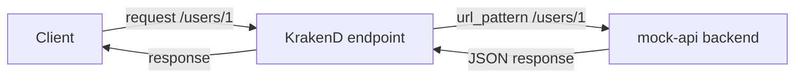

# Lab 01：建立第一個 KrakenD Gateway

目標：使用課程已定義好的環境，觀察 `/users/{id}` 如何透過 KrakenD 轉送到 mock backend。

預估時間：30 分鐘。

## 你會做出什麼

```mermaid
flowchart LR
    Client[Client] --> Gateway[KrakenD GET /users/{id}]
    Gateway --> Backend[mock-api GET /users/{id}]
    Backend --> Gateway
    Gateway --> Client
```

`Client` 只知道 KrakenD 的 `/users/{id}`。KrakenD 會把 `{id}` 帶到 mock backend 的 `/users/{id}`，再把結果回傳。

## Step 1：啟動共用課程環境

1. 確認目前位於 repo 根目錄：

```powershell
Get-ChildItem docker-compose.yaml, krakend.json
```

2. 啟動服務：

```powershell
docker compose up -d
```

3. 確認服務狀態：

```powershell
docker compose ps
```

說明：本 Lab 不需要學員自行建立 `krakend.json`。課程已在 repo 根目錄的 `krakend.json` 準備好範例設定。

## Step 2：檢查 `/users/{id}` 設定

打開 `krakend.json`，找到以下 endpoint：

```json
{
  "endpoint": "/users/{id}",
  "method": "GET",
  "backend": [
    {
      "host": ["http://mock-api:8000"],
      "url_pattern": "/users/{id}",
      "encoding": "json"
    }
  ]
}
```

重要設定：

| Parameter | Value |
| --- | --- |
| `endpoint` | `/users/{id}` |
| `method` | `GET` |
| `host` | `http://mock-api:8000` |
| `url_pattern` | `/users/{id}` |
| `encoding` | `json` |

說明：`host` 使用 Compose service name `mock-api`，所以 KrakenD 容器可以在 Docker network 內直接呼叫 mock backend。

## Step 3：驗證 KrakenD 設定檔

在 repo 根目錄執行：

```powershell
docker compose run --rm --no-deps krakend check --config /etc/krakend/krakend.json
```

確認輸出沒有 JSON 格式錯誤或路由衝突。

說明：`krakend check` 會檢查設定檔是否能被 KrakenD 解析。先 check 再 restart，可以把錯誤停在啟動前。

## Step 4：呼叫 Gateway

1. 確認 KrakenD 已啟動：

```powershell
curl http://localhost:18000/__health
```

2. 透過 KrakenD 呼叫 user API：

```powershell
curl http://localhost:18000/users/1
```

3. 直接呼叫 mock backend，比較兩者資料：

```powershell
curl http://localhost:18081/users/1
```

說明：`18000` 是 KrakenD 對 host 暴露的 port，`18081` 是 mock backend 暴露給 host 的檢查用 port。實際 Lab 呼叫應以 KrakenD 的 `18000` 為主。

## 練習題

### 練習 1：改變對外 API 路徑

保留目前 `backend` 設定，只把 `endpoint` 改成 `/public/users/{id}`。

確認方式：

1. 執行 `docker compose run --rm --no-deps krakend check --config /etc/krakend/krakend.json`。
2. 執行 `docker compose restart krakend`。
3. 執行 `curl http://localhost:18000/public/users/1`。
4. 確認舊路徑 `http://localhost:18000/users/1` 不再是這個 endpoint。

### 練習 2：改變 backend 路徑參數

沿用練習 1 的設定，把 `endpoint` 改成 `/members/{member_id}`，並把 `url_pattern` 改成 `/users/{member_id}`。

確認方式：

1. 執行 `docker compose run --rm --no-deps krakend check --config /etc/krakend/krakend.json`。
2. 執行 `docker compose restart krakend`。
3. 執行 `curl http://localhost:18000/members/1`。
4. 確認仍取得 user 1 的資料。

練習後若要回到後續 Lab 的預設狀態，請把 `endpoint` 改回 `/users/{id}`，把 `url_pattern` 改回 `/users/{id}`，再重新執行 `check` 與 `restart`。

## 完成檢查

- 你知道 `endpoint` 是 KrakenD 對外提供的路徑。
- 你知道 `backend.host` 與 `backend.url_pattern` 組成 upstream URL。
- 你知道 Compose service name 可以作為容器間連線的 host。
- 你知道修改設定後要先用 `krakend check` 驗證。

## 常見錯誤

- `invalid character`：通常是 JSON 多了逗號、少了引號或括號沒有成對。
- `connection refused`：Gateway 沒有啟動，或 host port 不是 `18000`。
- 呼叫 `/users/1` 得到 404：確認你是否在練習中已把 `endpoint` 改成其他路徑。
- `mock-api` 無法連線：確認 `docker compose ps` 中 `mock-api` 是 `healthy`。

## 本 Lab 的學習重點回顧

這個 Lab 建立的是最小 Gateway 代理流程：



整個流程的意思是：

1. `Client` 呼叫 KrakenD，不直接知道 upstream host。
2. `endpoint` 接住對外路徑與路徑參數。
3. `backend` 決定 KrakenD 要呼叫哪個 upstream。
4. `encoding` 讓 KrakenD 知道如何解析回應。

做完後你要理解：

- KrakenD 是用設定檔定義 API Gateway 行為。
- `endpoint` 與 `backend` 是最重要的第一層責任切分。
- 課程環境已把 Gateway 與 backend 定義好，學員可以專注觀察 KrakenD 行為。
