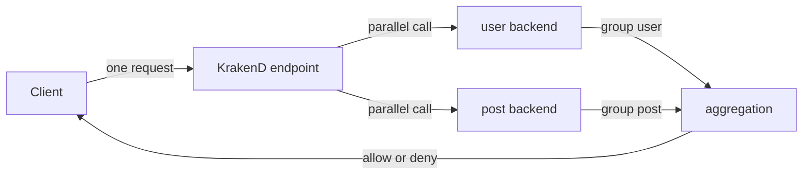

# Lab 02：聚合多個 Backend 並整理回應欄位

目標：建立一個 `/user-summary/{id}` endpoint，讓 KrakenD 同時取得 user 與 post 詳細資料，並控制回應欄位。

預估時間：40 分鐘。

## 你會做出什麼

```mermaid
flowchart LR
    Client[Client] --> Gateway[KrakenD GET /user-summary/{id}]
    Gateway --> Users[GET /users/{id}]
    Gateway --> Post[GET /posts/{id}]
    Users --> Gateway
    Post --> Gateway
    Gateway --> Response[merged JSON response]
```

KrakenD 會用一個對外 endpoint 呼叫兩個 backend。這是 API Gateway 常見的 Backend For Frontend 用法：前端只打一個 API，Gateway 幫你整理多個 upstream。

## Step 1：建立新的 Lab 目錄

1. 建立並進入新的操作資料夾：

```powershell
mkdir krakend-lab-02
cd krakend-lab-02
```

2. 不要沿用 Lab 01 的 `krakend.json`。

說明：本 Lab 需要多 backend 聚合。沿用上一個檔案容易讓你混淆是哪一個 endpoint 在回應。

## Step 2：建立聚合 endpoint

1. 新增 `krakend.json`。
2. 貼上以下內容：

```json
{
  "$schema": "https://www.krakend.io/schema/v2.13/krakend.json",
  "version": 3,
  "name": "krakend-lab-02",
  "port": 8080,
  "endpoints": [
    {
      "endpoint": "/user-summary/{id}",
      "method": "GET",
      "backend": [
        {
          "host": ["https://jsonplaceholder.typicode.com"],
          "url_pattern": "/users/{id}",
          "encoding": "json",
          "group": "user",
          "allow": ["id", "name", "email", "company.name"]
        },
        {
          "host": ["https://jsonplaceholder.typicode.com"],
          "url_pattern": "/posts/{id}",
          "encoding": "json",
          "group": "post",
          "allow": ["id", "title"]
        }
      ]
    }
  ]
}
```

重要設定：

| Parameter | Value |
| --- | --- |
| `endpoint` | `/user-summary/{id}` |
| 第一個 `group` | `user` |
| 第二個 `group` | `post` |
| 第一個 `allow` | `id`, `name`, `email`, `company.name` |
| 第二個 `allow` | `id`, `title` |

說明：`group` 用來避免多個 backend 回應欄位混在同一層。`allow` 只保留指定欄位，讓 Gateway 回應更接近前端需要的資料形狀。

## Step 3：驗證並啟動 Gateway

1. 驗證設定：

```powershell
docker run --rm -it -v "${PWD}:/etc/krakend/" krakend check --config krakend.json
```

2. 啟動 Gateway：

```powershell
docker run --rm -p 8080:8080 -v "${PWD}:/etc/krakend/" krakend run -d -c /etc/krakend/krakend.json
```

3. 呼叫 endpoint：

```powershell
curl http://localhost:8080/user-summary/1
```

4. 觀察回應中是否出現 `user` 與 `post` 兩個分組。

說明：預設聚合會平行呼叫多個 backend。這適合彼此不依賴的資料來源，可以縮短前端等待時間。

## Step 4：用 `deny` 移除不想回傳的欄位

1. 保留 Step 2 的設定。
2. 將第一個 backend 改成以下片段：

```json
{
  "host": ["https://jsonplaceholder.typicode.com"],
  "url_pattern": "/users/{id}",
  "encoding": "json",
  "group": "user",
  "deny": ["address", "phone", "website"]
}
```

3. 重新執行 `krakend check`。
4. 重新啟動 Gateway。
5. 再次呼叫：

```powershell
curl http://localhost:8080/user-summary/1
```

說明：`allow` 是白名單，`deny` 是黑名單。當你明確知道前端只需要哪些欄位時，優先用 `allow`；當你只想移除少數敏感或不必要欄位時，可以用 `deny`。

## 練習題

### 練習 1：只保留文章標題

保留 Step 4 的第一個 backend 設定，把第二個 backend 的 `allow` 改成只保留 `title`。

確認方式：

1. 呼叫 `curl http://localhost:8080/user-summary/1`。
2. 確認 `post` 裡沒有 `body`。
3. 確認 `post` 裡沒有 `userId`。

### 練習 2：移除 `group` 觀察回應差異

保留練習 1 的設定，移除兩個 backend 的 `group`。

確認方式：

1. 重新執行 `krakend check`。
2. 重新啟動 Gateway。
3. 呼叫 `curl http://localhost:8080/user-summary/1`。
4. 比較有 `group` 與沒有 `group` 的回應結構。

## 完成檢查

- 你知道一個 KrakenD endpoint 可以定義多個 backend。
- 你知道多 backend 預設適合處理彼此不依賴的平行資料。
- 你知道 `group` 可以讓聚合結果更容易閱讀。
- 你知道 `allow` 與 `deny` 的差異。

## 常見錯誤

- 回應欄位和預期不同：確認你目前使用的是 `allow` 還是 `deny`。
- 第二個 backend 沒有資料：確認 `url_pattern` 是 `/posts/{id}`。
- 回應結構混在一起：確認兩個 backend 是否有設定不同的 `group`。

## 本 Lab 的學習重點回顧

這個 Lab 建立的是聚合與欄位整理流程：



整個流程的意思是：

1. `Client` 只打一個 endpoint。
2. KrakenD 平行呼叫多個 backend。
3. `group` 決定每個 backend 結果放在哪個分組。
4. `allow` 或 `deny` 決定哪些欄位能進入最終回應。

做完後你要理解：

- Gateway 可以把多個後端 API 整理成前端需要的一個 API。
- 欄位整理應該有明確目的，例如降低 payload、避免暴露不必要資訊或對齊前端畫面。
- 多個 backend 之間若有相依關係，應評估 sequential proxy，而不是假裝平行聚合能解決順序問題。
