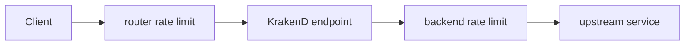
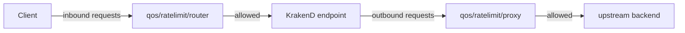

# Lab 03：替 Endpoint 與 Backend 加上限流

目標：在 KrakenD 設定 router rate limit 與 backend rate limit，理解「限制 client 進來」與「限制 Gateway 打出去」的差異。

預估時間：35 分鐘。

## 你會做出什麼



router rate limit 保護 KrakenD 對外 endpoint，backend rate limit 保護 upstream。兩者位置不同，解決的問題也不同。

## Step 1：建立新的 Lab 目錄

1. 建立並進入新的操作資料夾：

```powershell
mkdir krakend-lab-03
cd krakend-lab-03
```

2. 確認沒有沿用 Lab 02 的聚合設定。

說明：本 Lab 要觀察限流行為，沿用多 backend 聚合設定會讓結果變得不容易判讀。

## Step 2：建立 endpoint rate limit

1. 新增 `krakend.json`。
2. 貼上以下內容：

```json
{
  "$schema": "https://www.krakend.io/schema/v2.13/krakend.json",
  "version": 3,
  "name": "krakend-lab-03",
  "port": 8080,
  "endpoints": [
    {
      "endpoint": "/limited-users/{id}",
      "method": "GET",
      "extra_config": {
        "qos/ratelimit/router": {
          "max_rate": 2,
          "every": "1s",
          "capacity": 2
        }
      },
      "backend": [
        {
          "host": ["https://jsonplaceholder.typicode.com"],
          "url_pattern": "/users/{id}",
          "encoding": "json"
        }
      ]
    }
  ]
}
```

重要設定：

| Parameter | Value |
| --- | --- |
| `qos/ratelimit/router` | endpoint 層的限流 namespace |
| `max_rate` | `2` |
| `every` | `1s` |
| `capacity` | `2` |

說明：`qos/ratelimit/router` 放在 endpoint 的 `extra_config`，代表限制 client 呼叫這個 KrakenD endpoint 的速度。

## Step 3：驗證並啟動 Gateway

1. 驗證設定：

```powershell
docker run --rm -it -v "${PWD}:/etc/krakend/" krakend check --config krakend.json
```

2. 啟動 Gateway：

```powershell
docker run --rm -p 8080:8080 -v "${PWD}:/etc/krakend/" krakend run -d -c /etc/krakend/krakend.json
```

3. 在另一個終端機快速連續呼叫：

```powershell
1..10 | ForEach-Object { curl.exe -s -o NUL -w "%{http_code}`n" http://localhost:8080/limited-users/1 }
```

4. 觀察是否有部分請求被限流。

說明：限流使用 token bucket 類型的概念，短時間內的 burst 可能受 `capacity` 影響。不要只看單次呼叫，要用連續請求觀察。

## Step 4：加入 backend rate limit

1. 保留 Step 2 的 endpoint rate limit。
2. 將 backend 改成以下內容：

```json
{
  "host": ["https://jsonplaceholder.typicode.com"],
  "url_pattern": "/users/{id}",
  "encoding": "json",
  "extra_config": {
    "qos/ratelimit/proxy": {
      "max_rate": 1,
      "every": "1s",
      "capacity": 1
    }
  }
}
```

3. 重新執行 `krakend check`。
4. 重新啟動 Gateway。
5. 再次連續呼叫：

```powershell
1..10 | ForEach-Object { curl.exe -s -o NUL -w "%{http_code}`n" http://localhost:8080/limited-users/1 }
```

說明：`qos/ratelimit/proxy` 放在 backend 的 `extra_config`，代表限制 KrakenD 對 upstream 發出的請求。這不是限制 client 的第一道門，而是保護後端服務的出站控制。

## 練習題

### 練習 1：放寬 client 限流

保留 Step 4 的 backend rate limit，把 endpoint 的 `max_rate` 改成 `10`，`capacity` 改成 `10`。

確認方式：

1. 重新啟動 Gateway。
2. 連續呼叫 10 次。
3. 比較 HTTP status 分布是否和 Step 3 不同。

### 練習 2：移除 backend rate limit

保留練習 1 的 endpoint 設定，刪除 backend 裡的 `extra_config`。

確認方式：

1. 重新執行 `krakend check`。
2. 重新啟動 Gateway。
3. 連續呼叫 10 次。
4. 觀察只剩 router rate limit 時的行為。

## 完成檢查

- 你知道 `qos/ratelimit/router` 要放在 endpoint 層。
- 你知道 `qos/ratelimit/proxy` 要放在 backend 層。
- 你知道 router rate limit 與 backend rate limit 保護的對象不同。
- 你知道要用連續請求觀察限流，不是只呼叫一次。

## 常見錯誤

- 設定放了但沒效果：確認 `extra_config` 是否放在正確層級。
- 每次都回 200：限流值可能太寬，或請求沒有在同一時間窗內打出去。
- PowerShell 沒有顯示狀態碼：確認使用的是 `curl.exe`，不是 PowerShell 的 `curl` alias。

## 本 Lab 的學習重點回顧

這個 Lab 建立的是雙層限流流程：



整個流程的意思是：

1. `qos/ratelimit/router` 先控制 client 對 endpoint 的流量。
2. 通過 router limit 的請求才會進入 backend 呼叫流程。
3. `qos/ratelimit/proxy` 控制 KrakenD 對 upstream 的出站流量。
4. 兩者可以一起使用，但要清楚知道每一層是在保護誰。

做完後你要理解：

- 對外 API 防濫用通常從 router rate limit 開始。
- 保護後端服務容量時，需要 backend rate limit。
- 限流值不是越小越好，應依據服務容量、使用者行為與實際監控資料調整。
