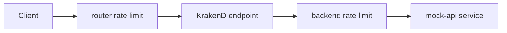
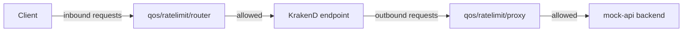

# Lab 03：替 Endpoint 與 Backend 加上限流

目標：使用課程環境中的 `/limited-users/{id}` endpoint，理解「限制 client 進來」與「限制 Gateway 打出去」的差異。

預估時間：35 分鐘。

## 你會做出什麼



router rate limit 保護 KrakenD 對外 endpoint，backend rate limit 保護 upstream。兩者位置不同，解決的問題也不同。

## Step 1：確認共用課程環境已啟動

1. 確認目前位於 repo 根目錄：

```powershell
Get-ChildItem docker-compose.yaml, krakend.json
```

2. 啟動或確認服務：

```powershell
docker compose up -d
docker compose ps
```

3. 確認基本 endpoint 可用：

```powershell
curl http://localhost:18000/users/1
```

說明：本 Lab 使用 repo 根目錄 `krakend.json` 內建的 `/limited-users/{id}` 設定。

## Step 2：檢查 endpoint rate limit

打開 `krakend.json`，找到 `/limited-users/{id}`：

```json
{
  "endpoint": "/limited-users/{id}",
  "method": "GET",
  "extra_config": {
    "qos/ratelimit/router": {
      "max_rate": 2,
      "every": "1s",
      "capacity": 2
    }
  },
  "backend": [
    {
      "host": ["http://mock-api:8000"],
      "url_pattern": "/users/{id}",
      "encoding": "json"
    }
  ]
}
```

重要設定：

| Parameter | Value |
| --- | --- |
| `qos/ratelimit/router` | endpoint 層的限流 namespace |
| `max_rate` | `2` |
| `every` | `1s` |
| `capacity` | `2` |

說明：`qos/ratelimit/router` 放在 endpoint 的 `extra_config`，代表限制 client 呼叫這個 KrakenD endpoint 的速度。

## Step 3：用連續請求觀察 router rate limit

1. 驗證設定：

```powershell
docker compose run --rm --no-deps krakend check --config /etc/krakend/krakend.json
```

2. 重新載入 KrakenD：

```powershell
docker compose restart krakend
```

3. 在另一個終端機快速連續呼叫：

```powershell
1..10 | ForEach-Object { curl.exe -s -o NUL -w "%{http_code}`n" http://localhost:18000/limited-users/1 }
```

4. 觀察是否有部分請求被限流。

說明：限流使用 token bucket 類型的概念，短時間內的 burst 可能受 `capacity` 影響。不要只看單次呼叫，要用連續請求觀察。

## Step 4：檢查 backend rate limit

課程環境預設已在 `/limited-users/{id}` 的 backend 加上以下設定：

```json
{
  "host": ["http://mock-api:8000"],
  "url_pattern": "/users/{id}",
  "encoding": "json",
  "extra_config": {
    "qos/ratelimit/proxy": {
      "max_rate": 1,
      "every": "1s",
      "capacity": 1
    }
  }
}
```

再次連續呼叫：

```powershell
1..10 | ForEach-Object { curl.exe -s -o NUL -w "%{http_code}`n" http://localhost:18000/limited-users/1 }
```

說明：`qos/ratelimit/proxy` 放在 backend 的 `extra_config`，代表限制 KrakenD 對 upstream 發出的請求。這不是限制 client 的第一道門，而是保護後端服務的出站控制。

## 練習題

### 練習 1：放寬 client 限流

保留 backend rate limit，把 endpoint 的 `max_rate` 改成 `10`，`capacity` 改成 `10`。

確認方式：

1. 執行 `docker compose run --rm --no-deps krakend check --config /etc/krakend/krakend.json`。
2. 執行 `docker compose restart krakend`。
3. 連續呼叫 10 次。
4. 比較 HTTP status 分布是否和 Step 3 不同。

### 練習 2：移除 backend rate limit

保留練習 1 的 endpoint 設定，刪除 backend 裡的 `extra_config`。

確認方式：

1. 重新執行 `krakend check`。
2. 重新啟動 KrakenD。
3. 連續呼叫 10 次。
4. 觀察只剩 router rate limit 時的行為。

練習後若要回到課程預設狀態，請把 `qos/ratelimit/router` 與 `qos/ratelimit/proxy` 改回本 Lab 的原始值，再重新執行 `check` 與 `restart`。

## 完成檢查

- 你知道 `qos/ratelimit/router` 要放在 endpoint 層。
- 你知道 `qos/ratelimit/proxy` 要放在 backend 層。
- 你知道 router rate limit 與 backend rate limit 保護的對象不同。
- 你知道要用連續請求觀察限流，不是只呼叫一次。

## 常見錯誤

- 設定放了但沒效果：確認 `extra_config` 是否放在正確層級。
- 每次都回 200：限流值可能太寬，或請求沒有在同一時間窗內打出去。
- PowerShell 沒有顯示狀態碼：確認使用的是 `curl.exe`，不是 PowerShell 的 `curl` alias。
- 修改後仍看到舊限流值：確認已執行 `docker compose restart krakend`。

## 本 Lab 的學習重點回顧

這個 Lab 建立的是雙層限流流程：



整個流程的意思是：

1. `qos/ratelimit/router` 先控制 client 對 endpoint 的流量。
2. 通過 router limit 的請求才會進入 backend 呼叫流程。
3. `qos/ratelimit/proxy` 控制 KrakenD 對 upstream 的出站流量。
4. 兩者可以一起使用，但要清楚知道每一層是在保護誰。

做完後你要理解：

- 對外 API 防濫用通常從 router rate limit 開始。
- 保護後端服務容量時，需要 backend rate limit。
- 限流值不是越小越好，應依據服務容量、使用者行為與實際監控資料調整。
