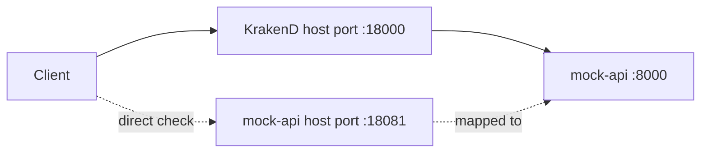
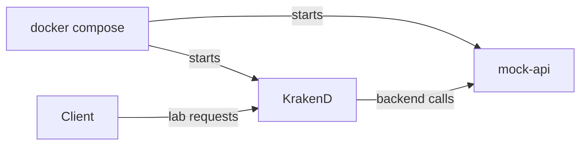

# KrakenD 課程環境

目標：用一個 `docker compose` 環境啟動 KrakenD 與課程用的 mock backend，讓所有 Lab 都能在同一套環境中操作。

預估時間：15 分鐘。

## 你會啟動什麼



`KrakenD` 是學員主要呼叫的 Gateway。`mock-api` 是課程內建的範例後端，提供 user、post、order 等固定資料。

## Step 1：確認工具

在 repo 根目錄執行：

```powershell
docker --version
docker compose version
```

說明：本課程使用 Docker Compose 啟動多容器環境。學員只需要本機有 Docker Desktop 或相容的 Docker Engine。

## Step 2：啟動課程環境

1. 確認目前位於 repo 根目錄。

```powershell
Get-ChildItem docker-compose.yaml, krakend.json
```

2. 拉取映像檔：

```powershell
docker compose pull
```

3. 啟動服務：

```powershell
docker compose up -d
```

4. 檢查服務狀態：

```powershell
docker compose ps
```

說明：`docker-compose.yaml` 已經定義 KrakenD、mock backend、port mapping 與啟動順序。後續 Lab 都沿用這個環境。

## Step 3：驗證 KrakenD 與 mock backend

1. 呼叫 KrakenD 健康檢查：

```powershell
curl http://localhost:18000/__health
```

2. 直接呼叫 mock backend：

```powershell
curl http://localhost:18081/health
```

3. 透過 KrakenD 呼叫課程 API：

```powershell
curl http://localhost:18000/users/1
```

確認方式：

1. `__health` 回應狀態正常。
2. `mock-api` 回應 `{"status":"ok"}`。
3. `/users/1` 回應 user JSON。

## Step 4：驗證 KrakenD 設定檔

在 repo 根目錄執行：

```powershell
docker compose run --rm --no-deps krakend check --config /etc/krakend/krakend.json
```

說明：修改 repo 根目錄的 `krakend.json` 後，先執行 `check`，再重新啟動 KrakenD。

## Step 5：重新載入設定

修改 `krakend.json` 後，在 repo 根目錄執行：

```powershell
docker compose restart krakend
```

若想完整重建環境：

```powershell
docker compose down
docker compose up -d
```

## 環境檔案說明

| Path | 用途 |
| --- | --- |
| `.env` | 固定課程使用的 Docker image 版本與 host port |
| `docker-compose.yaml` | 定義 KrakenD 與 mock backend 服務 |
| `krakend.json` | 課程使用的 KrakenD 設定 |
| `mock-api/mock_api.py` | 課程用範例 backend 程式碼 |

## 完成檢查

- 你知道課程環境由 `docker compose` 啟動。
- 你知道 KrakenD 對 host 暴露的 port 是 `18000`。
- 你知道 mock backend 對 host 暴露的 port 是 `18081`。
- 你知道修改 `krakend.json` 後要執行 `check` 與 `restart`。

## 常見錯誤

- `port is already allocated`：本機 `18000` 或 `18081` 已被占用，先停止占用該 port 的服務，或調整 `.env` 裡的 host port。
- `Cannot connect to the Docker daemon`：Docker Desktop 尚未啟動。
- `krakend` 啟動後 endpoint 回 502：確認 `mock-api` 是 `healthy`。
- 修改設定沒有生效：確認已在 repo 根目錄執行 `docker compose restart krakend`。

## 本 Lab 的學習重點回顧

這個環境建立的是可重複啟動的課程沙箱：



整個流程的意思是：

1. `docker compose` 負責啟動課程需要的服務。
2. `KrakenD` 負責接收 Lab 的 API 呼叫。
3. `mock-api` 提供可預期的後端資料，避免課程依賴外部網路服務。
4. 學員只要照 Lab 指令操作，就能觀察 Gateway 行為。
